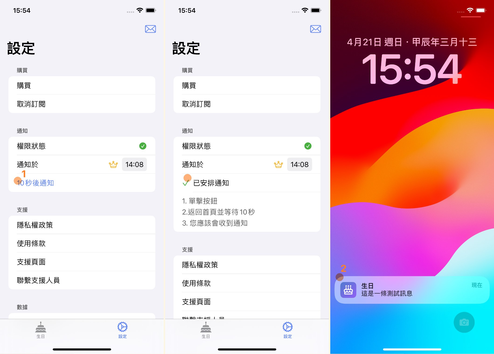

# {{ $frontmatter.title }}

{{ $frontmatter.description }}

## 下載應用

[點擊這個連結](https://apps.apple.com/us/app/birthday-reminder-lunar-cal/id6479518154)在 App Store 中下載應用

## 增加提醒事項

1. 導航到生日頁, 點擊右上角的增加按鈕以進入編輯頁.
2. 在編輯頁輸入你的朋友的名字.
3. 在編輯頁的時間選擇器中選擇你的朋友的農曆生日.
4. 勾選右上角的確認按鈕.
5. 此時您將發現一條新的記錄被添加了. 這意味, 在你的朋友生日那天, 一條提醒事項將會在你的手機中.

## 測試提醒功能

為了確保到了生日那天提醒通知會被正確觸發， 我們需要保證當前應用獲得了提醒許可權.

1. 導航到設置頁， 點擊 10 秒後通知. 之後返回手機主頁.
2. 打開通知中心， 10 秒後應該會出現一條新的通知.

> 如果通知未出現， 您可以點擊應用程式中設定頁的權限狀態按鈕. 這將帶領您前往許可權設置頁面. 您可以在該頁面中手動開啟關閉應用程式的通知權限.
